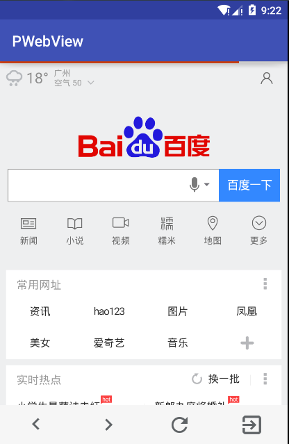

## PWebView
**增加了加载进度条和浏览控制的WebView**

#### 使用
**Gradle**
```
compile 'com.weicong.library:pwebview:1.0.0'
```

**布局文件**
```xml
<?xml version="1.0" encoding="utf-8"?>
<RelativeLayout xmlns:android="http://schemas.android.com/apk/res/android"
    xmlns:tools="http://schemas.android.com/tools"
    android:layout_width="match_parent"
    android:layout_height="match_parent"
    tools:context="com.weicong.pwebview.MainActivity">

    <com.weicong.library.PWebView
        android:id="@+id/webView"
        android:layout_width="match_parent"
        android:layout_height="match_parent">

    </com.weicong.library.PWebView>

</RelativeLayout>
```

**Java代码**
```java
PWebView pWebView = (PWebView) findViewById(R.id.webView);
pWebView.loadUrl("http://www.baidu.com");

// 隐藏控制栏
// pWebView.hideBrowserController();
```

**效果图：**


